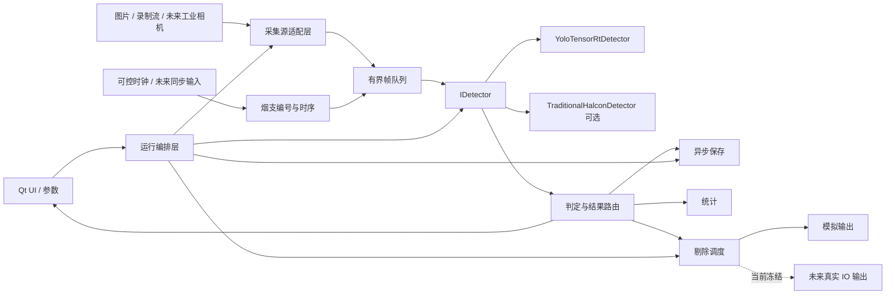

# 系统架构

## 目标结构

## 依赖方向

1. UI 只调用运行编排和配置接口，不直接操作 TensorRT、相机 SDK 或 IO 端口。
2. 运行编排依赖抽象接口：采集源、检测器、结果存储、剔除输出和时钟。
3. SDK 适配层实现这些接口；业务数据结构不包含 SDK 回调的借用指针。
4. 检测器返回统一结果；模型类别映射和 OK/NG 业务规则位于结果判定层。
5. 剔除调度只消费已确认的 `InspectionResult`，真实 IO 实现受配置和运行安全状态双重控制。

禁止反向依赖：检测器不得访问 UI；相机回调不得调用保存、推理或剔除；老版 `testQT` 不得成为新版链接依赖。

## 核心数据契约

P2 已在 `源码/core` 形成只依赖 C++14 标准库的类型：

- `FramePacket`：拥有图像内存或安全共享所有权，包含 frame_id、工位、相机、烟支编号、采集时间、尺寸和像素格式。
- `Detection`：类别 ID、类别名称、置信度、边界框和检测器版本。
- `InspectionResult`：frame_id、OK/NG、缺陷列表、耗时、参数版本和错误状态。
- `RejectCommand`：来源 frame_id、烟支编号、目标输出、计划时间和模拟/真实标志；执行回执使用独立的 `RejectExecutionResult`，避免输出实现反向修改调度意图。

`DetectionBatch` 承载检测器原始输出、版本、耗时和错误；OK/NG 仍由结果判定层产生 `InspectionResult`。接口数据可在不连接 Qt、Halcon、MVS、GPU 和 IO 的测试中构造。

P2 同时定义 `IFrameSource`、`IDetector`、`IInspectionResultSink`、`IRejectOutput`、`IClock`，以及带容量、显式溢出结果、丢弃计数和关闭语义的 `BoundedQueue<T>`。当前旧 `picStruct` 和 Qt 队列仅作为尚未迁移的相机内部通路保留；P6 先通过文件/录制流实现本地实时消费者，真实相机回调迁移冻结，P2 不建立双路入队。

P3 在上述边界上增加 `OfflineInspectionSession`，每次运行创建独立有界队列和生产/消费线程，消费端只依赖 `IDetector`、结果 sink、帧 archive 和 observer。Qt 适配器负责图片解码/深拷贝、SHA-256 校验、原子 JSON/PNG 保存和 queued UI 信号；核心层不依赖 Qt。`--offline` 跳过 `initCamera()`/`initIOCard()`，批处理入口在构造主窗口前执行，因此不触达相机、DAQNavi 或剔除输出。当前 detector 仅为可重复编排测试 fixture；P4 通过同一 `IDetector` 边界替换，不能将 fixture 视为产品算法。

P4 新增 `adapters/tensorrt/TensorRtDetector`，用 PImpl 隔离 TensorRT/CUDA/OpenCV，并通过名称 API 验证固定 I/O 契约。`--tensorrt-batch-manifest` 只在构造主窗口前运行离线源，配置必须显式给出 engine、张量名、输入尺寸、阈值、类别表、禁用类别和预处理版本；初始化或运行错误不得回退为空检测。第一版单实例以 mutex 串行保护 execution context/stream/buffer。标准预处理为 OpenCV `INTER_LINEAR` 直接拉伸、RGB、FP32 `[0,1]`、CHW；这是当前 ONNX 导出契约，不代表未来模型可以隐式沿用。

## 线程与队列边界

- 相机回调：复制/接管必要图像数据、附加元数据、尝试入有界队列，然后立即返回。
- 检测工作线程：从帧队列取数据并调用检测器；不得直接更新 QWidget。
- 保存工作线程：消费保存任务；磁盘慢或满时记录错误并执行明确丢弃策略。
- 模拟剔除线程：按烟支编号和可控时钟调度，只写结构化命令与回执；真实 IO 适配器当前不进入运行图。
- UI 线程：通过 Qt signal/slot 接收轻量结果和状态快照。

P3 离线运行使用固定容量 4 并在默认 RejectNewest 策略下施加生产者背压；UI 停止使用 `drainOnStop=false`，不会继续排空整批。DropOldest 仍由容量 1 的核心测试验证。P6 将以可配置本地节拍测量容量、线程数和积压曲线；这些本地参数不能从 8 图 fixture 外推，也不能冒充现场生产参数。

## 现有目录职责

| 目录 | 角色 | 规则 |
| --- | --- | --- |
| `01_上位机_QT_新版_CigVision/源码` | 最终产品源码 | 新功能和修复进入这里 |
| `02_上位机_QT_老版_传统算法` | 业务时序与传统算法参考 | 默认只读，不直接打包进产品 |
| `03_深度学习模型与TensorRT` | 推理原型、模型、转换资料 | 复用核心推理能力，先清理硬编码依赖 |
| `04_测试数据与样例图片` | 离线回放输入 | 后续补充清单、标签和哈希 |
| `07_运行环境与依赖包` | 本机部署材料 | 不进入普通 Git 提交 |
| `docs` | 项目记录系统 | 每阶段同步更新 |

## 迁移策略

从老版只迁移经过重新建模的业务规则：烟支编号、工位延迟、NG 聚合、保存分类和剔除时序。硬编码盘符、全局裸队列、SDK 借用指针、回调中大块处理以及默认写真实 IO 的做法不迁移。

TensorRT 原型先包装成 `IDetector` 实现，再接入运行编排；不把 demo 的 `imshow`、固定模型路径和构建机绝对路径带入上位机。

## 可机械检查的规则

- P1 起新增代码不得把绝对盘符路径写入业务逻辑。
- 相机帧数据结构不得保存 SDK 回调参数的非拥有型指针。
- 真实 IO 写调用必须经过 `simulation=false` 和运行安全状态检查。
- 每个阶段必须有一个可重复验证命令，并记录到 `docs/review-packet.md`。

## 当前阶段架构边界

- P5 只建立数据、标注、评估和算法优化闭环，不接相机、IO 或真实剔除。
- P5 人工复核工作台是独立的 localhost 工具，不链接 Qt、TensorRT、MVS 或 DAQNavi。浏览器只编辑后端返回的 draft；后端负责路径、图片哈希、框边界、类别目录、操作者身份、首标/复核顺序和导出状态校验。首标导出保持 `is_ground_truth=false`；只有不同复核人、approved 外部授权和完整 reviewed 状态同时成立时，后端才允许生成真值候选。
- P6 将图片/录制流、可控时钟、模拟编号和 `IRejectOutput` 的模拟实现接入运行编排；所有输出必须标记 `simulation=true`。
- P7 在现有新版 Qt 视觉风格内重构产品工作流，不更换整体 UI 风格；删除旧控件前需证明其无有效消费者或提供替代路径。
- P8 只验收本机稳定性、性能、部署和恢复能力。未来真实硬件适配器保留接口边界，但不进入当前运行图和验收声明。
