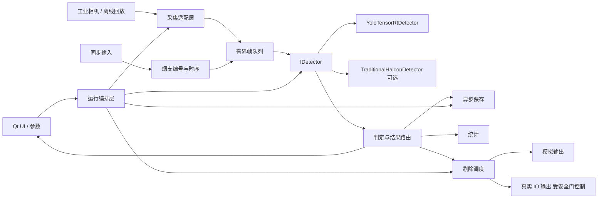

# 系统架构

## 目标结构

## 依赖方向

1. UI 只调用运行编排和配置接口，不直接操作 TensorRT、相机 SDK 或 IO 端口。
2. 运行编排依赖抽象接口：采集源、检测器、结果存储、剔除输出和时钟。
3. SDK 适配层实现这些接口；业务数据结构不包含 SDK 回调的借用指针。
4. 检测器返回统一结果；模型类别映射和 OK/NG 业务规则位于结果判定层。
5. 剔除调度只消费已确认的 `InspectionResult`，真实 IO 实现受配置和运行安全状态双重控制。

禁止反向依赖：检测器不得访问 UI；相机回调不得调用保存、推理或剔除；老版 `testQT` 不得成为新版链接依赖。

## 核心数据契约

后续在 P2 形成 C++ 类型，字段至少覆盖：

- `FramePacket`：拥有图像内存或安全共享所有权，包含 frame_id、工位、相机、烟支编号、采集时间、尺寸和像素格式。
- `Detection`：类别 ID、类别名称、置信度、边界框和检测器版本。
- `InspectionResult`：frame_id、OK/NG、缺陷列表、耗时、参数版本和错误状态。
- `RejectCommand`：来源 frame_id、烟支编号、目标输出、计划时间、模拟/真实标志和执行结果。

接口数据必须可在不连接相机、GPU 和 IO 的测试中构造。

## 线程与队列边界

- 相机回调：复制/接管必要图像数据、附加元数据、尝试入有界队列，然后立即返回。
- 检测工作线程：从帧队列取数据并调用检测器；不得直接更新 QWidget。
- 保存工作线程：消费保存任务；磁盘慢或满时记录错误并执行明确丢弃策略。
- 剔除工作线程：按烟支编号和现场时序调度；停止、异常或安全门关闭时不写真实 IO。
- UI 线程：通过 Qt signal/slot 接收轻量结果和状态快照。

队列容量、溢出策略和线程数量在 P3 通过离线回放测量后确定，不能继续使用无界增长假设。

## 现有目录职责

| 目录 | 角色 | 规则 |
| --- | --- | --- |
| `01_上位机_QT_新版_CigVision/源码` | 最终产品源码 | 新功能和修复进入这里 |
| `02_上位机_QT_老版_传统算法` | 业务时序与传统算法参考 | 默认只读，不直接打包进产品 |
| `03_深度学习模型与TensorRT` | 推理原型、模型、转换资料 | 复用核心推理能力，先清理硬编码依赖 |
| `04_测试数据与样例图片` | 离线回放输入 | 后续补充清单、标签和哈希 |
| `07_运行环境与依赖包` | 本机部署材料 | 不进入普通 Git 提交 |
| `docs` | 项目记录系统 | 每阶段同步更新 |

## 迁移策略

从老版只迁移经过重新建模的业务规则：烟支编号、工位延迟、NG 聚合、保存分类和剔除时序。硬编码盘符、全局裸队列、SDK 借用指针、回调中大块处理以及默认写真实 IO 的做法不迁移。

TensorRT 原型先包装成 `IDetector` 实现，再接入运行编排；不把 demo 的 `imshow`、固定模型路径和构建机绝对路径带入上位机。

## 可机械检查的规则

- P1 起新增代码不得把绝对盘符路径写入业务逻辑。
- 相机帧数据结构不得保存 SDK 回调参数的非拥有型指针。
- 真实 IO 写调用必须经过 `simulation=false` 和运行安全状态检查。
- 每个阶段必须有一个可重复验证命令，并记录到 `docs/review-packet.md`。
